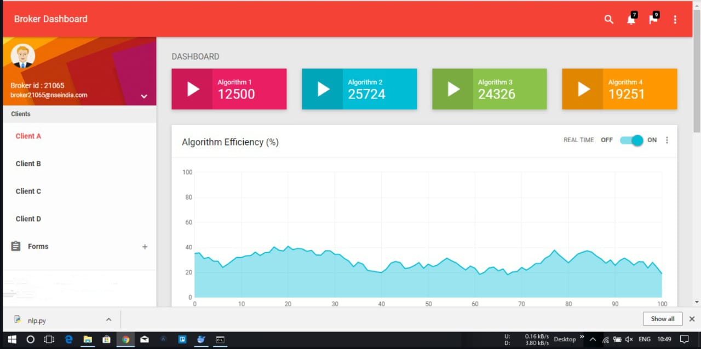
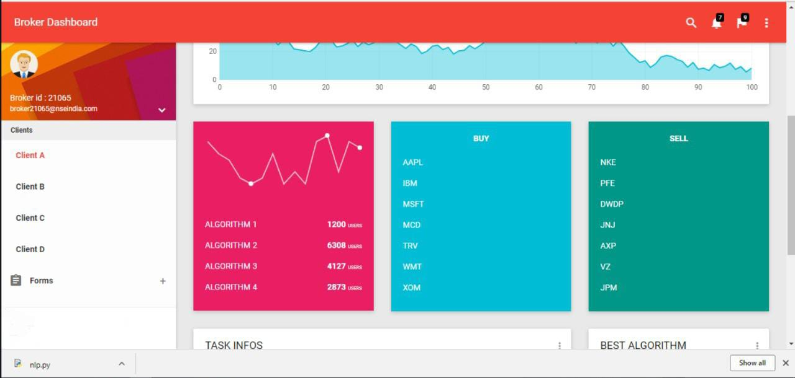
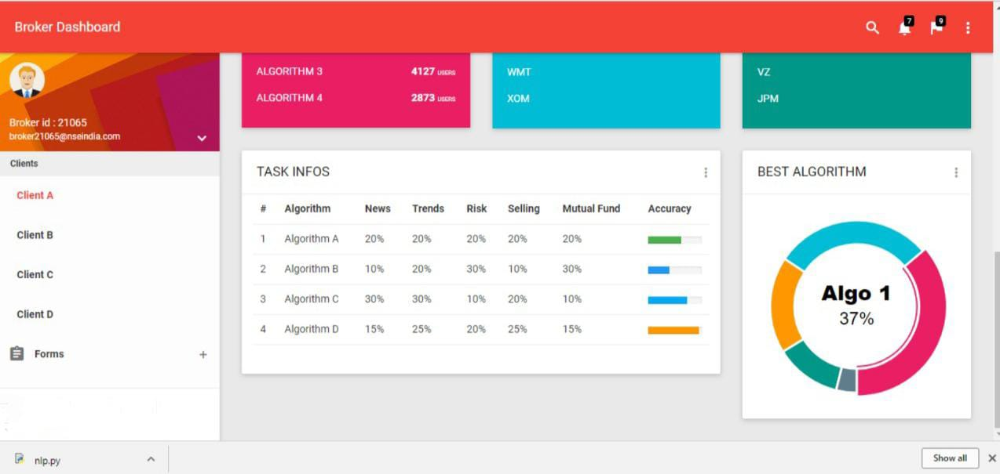
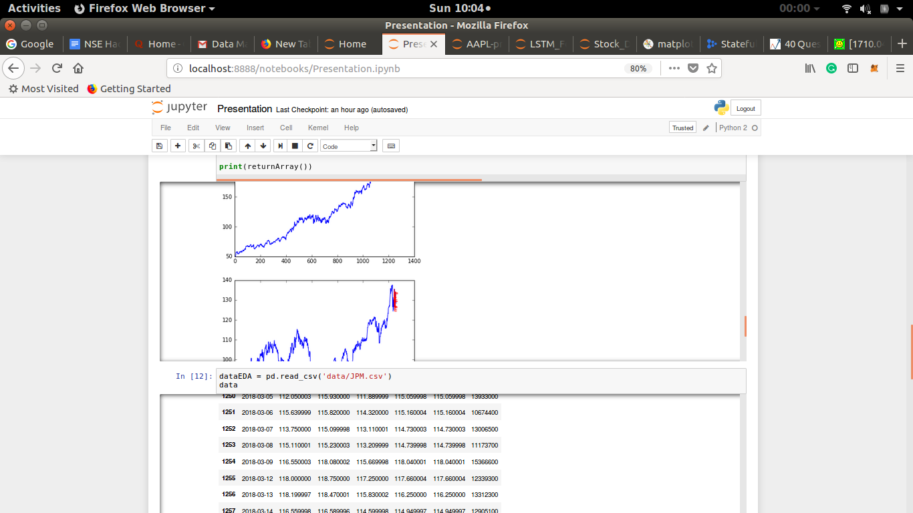
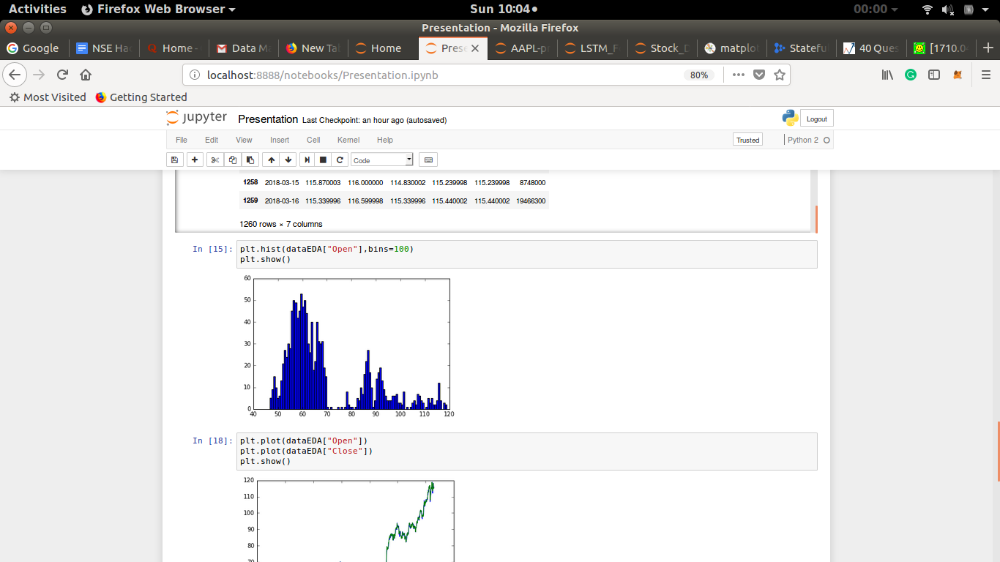

# Stockopedia  

**Invest in your dreams by leveraging deep learning for smarter trading decisions.**  

## Stateful LSTM  

We implemented **Multistep Time Series Prediction** using **Stateful LSTMs**, which utilize the batching property of LSTMs to retain memory across sequences. Our model learns from various financial parameters, analyzed through rigorous data exploration and fine-tuned hyperparameters.  

For this project, we used **Dow Jones Top 30 Stocks** as the primary dataset.  

  

## Key Features of Our Trading Algorithms  

Our model integrates multiple financial heuristics to enhance stock predictions and risk assessments:  

- **Mutual Funds Analysis** – Evaluates fund performance and investment strategies.  
- **Prediction Analysis** – Uses deep learning to forecast stock price trends.  
- **Portfolio Risk Assessment** – Analyzes volatility and risk factors in investment portfolios.  
- **News Sentiment Analysis** – Extracts and interprets market sentiment from financial news.  

  
  

## Exploratory Data Analysis  

Our **time-series analysis** explores historical trends and market behaviors, aiding in model optimization.  

  
*Time Series Data*  

We also conducted **histogram-based stock analysis**, focusing on companies like **JP Morgan** to examine price distributions and volatility.  

  
*JP Morgan Stock Analysis*  

## Credits  

**Team**  
- [Aakash Arya](https://github.com/Aakash22Arya)
- [Adarsh Singh](https://github.com/adarshsingh-01)
- [Abhijeet Nandi](https://github.com/Abhijeet122333)
